# Lattency

> A crowdsourced metro map of café wifi speeds in Nairobi.
> Cafés are stations. The three lines are speed tiers, not geography.

Built for the [Vercel × AWS Databases hackathon](https://vercel.com/blog/vercel-aws-databases). The same engine could map any city — the schematic ↔ geographic morph proves it.

---

## The hackathon stack

| Layer    | Choice                                             | Why                                                                              |
| -------- | -------------------------------------------------- | -------------------------------------------------------------------------------- |
| Database | **Amazon Aurora PostgreSQL Serverless v2** (16.6)  | PostGIS for `ST_DWithin` station lookups; auto-pauses at 0 ACU when idle         |
| Frontend | **Next.js 16.3** on **Vercel** (App Router, RSC)   | Cinematic scroll-driven SVG map (GSAP) over a server-rendered shell             |
| Network  | TLS-only, `pg.Pool` singleton on `globalThis`      | Serverless-safe — the warm-function pool is reused across invocations           |

Aurora DSQL and DynamoDB were on the menu; PostGIS forced Aurora PG.

---

## Architecture

```mermaid
flowchart LR
  Browser["Browser<br/>(GSAP scroll cinematic)"]
  Vercel["Vercel Edge / Function<br/>(Next.js 16.3 App Router)"]
  Pool["pg.Pool singleton<br/>(globalThis cache)"]
  Aurora["Aurora PostgreSQL<br/>Serverless v2 + PostGIS<br/>eu-north-1"]
  MV["cafe_speed_stats<br/>(materialized view)"]

  Browser -- "GET /<br/>GET /api/cafes/near<br/>POST /api/measurements" --> Vercel
  Vercel --> Pool
  Pool -- "TLS · 5432" --> Aurora
  Aurora --> MV
  MV -- "tier = express &#124; local &#124; suspended" --> Aurora
```



**Read path:** `cafe_speed_stats` joins cafés to median measurement values and pre-computes the tier. The API joins it laterally with the latest non-null `photo_url` per café.

**Write path:** `POST /api/measurements` inserts a row, derives `time_bucket` from the timestamp in `Africa/Nairobi`, and `REFRESH MATERIALIZED VIEW CONCURRENTLY cafe_speed_stats` so the next read reflects it (the unique index on `cafe_id` makes CONCURRENTLY work).

**Fallback path:** If Aurora is unreachable or cold-starting (15–30s), `lib/cafes.ts` degrades gracefully to a bundled Nairobi snapshot (`lib/mock-cafes.ts`) so the page never white-screens. The mock includes haversine distance for "near me" queries, so the full interactive experience works even without a live database.

---

## Quick start

### Prerequisites

- Node 22+ and pnpm 10+
- AWS CLI authenticated against an account with `AmazonRDSFullAccess` + `AmazonEC2FullAccess`

### Local + Aurora in five commands

```bash
pnpm install
bash scripts/provision-aurora.sh   # ~6–8 min, idempotent, writes DATABASE_URL to .env.local
pnpm migrate                       # applies migrations/0001..0003
pnpm seed                          # 12 Nairobi cafés, 48 measurements
pnpm dev                           # random high port (see AGENTS.md)
```

`scripts/provision-aurora.sh` creates the cluster, opens port 5432 only to your current public IP, and generates a 32-char hex password. Re-run after roaming to refresh the IP rule.

### Scripts

| Command          | Purpose                                                                  |
| ---------------- | ------------------------------------------------------------------------ |
| `pnpm dev`       | Next.js dev server with Turbopack                                        |
| `pnpm build`     | Production build                                                         |
| `pnpm lint`      | ESLint                                                                   |
| `pnpm migrate`   | Apply pending SQL migrations, tracked in `schema_migrations`             |
| `pnpm seed`      | TRUNCATE + reseed Nairobi data, refresh `cafe_speed_stats`               |
| `pnpm db:check`  | Print PostgreSQL + PostGIS version (smoke test the connection)           |

---

## Project layout

```
app/
├── page.tsx                  # Utility-first Nairobi home: hero + MapShell + StationDirectory
├── sf/page.tsx               # San Francisco home — same shell, scoped to city='sf'
├── tour/page.tsx             # The cinematic experience (scroll-driven, 800vh)
├── cafes/[slug]/page.tsx     # Per-café standalone page (SSG across both cities, OG metadata)
├── cafes/[slug]/opengraph-image.tsx # Per-café OG image (1200×630, tier badge + stats + signal quality)
├── partners/page.tsx         # /partners — two-sided monetization pitch + open bounties board
├── me/page.tsx               # /me — logged-in contributor dashboard (readings + cafés added)
├── me/error.tsx              # Boundary for /me-only render failures
├── auth/signin/page.tsx      # Magic-link sign-in form in the poster aesthetic
├── auth/verify/page.tsx      # "Check your email" confirmation
├── error.tsx                 # Route-level error boundary (recoverable, in-aesthetic)
├── global-error.tsx          # Last-resort layout-failure boundary
├── api/auth/[...nextauth]    # Auth.js v5 handler (signin/signout/callback/session/csrf/...)
├── api/cafes                 # POST /api/cafes (create café + first measurement in one transaction)
├── api/cafes/near            # GET /api/cafes/near?lat&lng&radius (ST_DWithin)
├── api/cafes/[id]            # GET /api/cafes/:id (detail + time-bucket distribution + recent readings)
├── api/measurements          # POST /api/measurements (insert + rate-limit + outlier flag + refresh MV)
├── api/warm                  # GET /api/warm — Aurora warmer poked by Vercel cron every 5min
├── api/speedtest/upload      # POST /api/speedtest/upload (consume + discard body, for upload phase)
├── api/speedtest/whereami    # GET /api/speedtest/whereami (Vercel edge region for transparency)
├── opengraph-image.tsx       # Dynamic OG image (1200×630, masthead aesthetic)
└── icon.svg                  # Favicon — minimal three-line metro mark

components/
├── top-nav.tsx               # Sticky nav: BrandMark · LATTENCY · CitySwitcher · Map · Watch the story
├── brand-mark.tsx            # Coffee-cup + wifi-arcs glyph — used in top-nav and masthead, paths match icon.svg
├── city-switcher.tsx         # Nairobi (live) + 5 "coming soon" cities — multi-city ambition
├── map-shell.tsx             # Product-grade map: SVG schematic ↔ Leaflet geographic toggle, hosts the "+ Map a café" CTA
├── map-leaflet.tsx           # Leaflet wrapper — CARTO Light tiles, tier markers, focus pin
├── cinematic-map.tsx         # GSAP scroll-driven SVG map (used on /tour only)
├── masthead.tsx              # Hero block with steam-wisp coffee identity (on /tour); carries the BrandMark on the edition stamp
├── legend.tsx                # Three lines of service (roast vocabulary + bean glyph)
├── station-directory.tsx     # Interactive list: geolocation finder, tier filter, clickable cards + vibe chips + signal quality
├── cafe-detail.tsx           # Slide-in modal: distribution chart + stats + signal quality + vibe chips + last-brewed ticker + form
├── cafe-page.tsx             # Full-page version of CafeDetail for /cafes/[slug]
├── cafe-metadata-display.tsx # Renders coffee metadata (price / milk / outlets / seating / wifi) as chips (cards) or labeled rows (detail)
├── vibe-chips.tsx            # Compact mono chips that ride under the editorial vibe line (`outlets++`, `oat-milk`, `pour-over`, …)
├── recent-readings.tsx       # "Last brewed here" ticker — last 5 readings with relative timestamps, useSyncExternalStore tick
├── sponsor-badge.tsx         # "$ Sponsored · [Sponsor]" badge surfaced on sponsored café tiles + detail pages; receives Sponsor prop resolved server-side
├── bounties-board.tsx        # Coffee Bounties — DB-backed (lib/bounties getBounties + mock fallback); on homepage + /partners
├── auth-slot.tsx             # Client-side session indicator in the top nav — keeps the public pages statically prerenderable
├── cafe-contribution-form.tsx # 5-step modal with step indicator, speed-test phase chips, demo prefill
├── measurement-form.tsx      # One-click in-browser speed test + manual entry fallback, optimistic UI
├── signal-quality.tsx        # Shared signal-quality indicator (jitter/loss bars + stability label)
└── copy-share-link.tsx       # "Share link" button (writes window.location to clipboard)

lib/
├── db.ts                     # pg.Pool singleton + withTransaction(exec) helper + Executor type for atomic multi-statement writes
├── cafes.ts                  # getCafes({city}) + getCafeById(id) + getCafeBySlug(slug); LIST_COLUMNS drops cs.photo_url so list payloads stay bounded; joins active sponsorship via the MV
├── cities.ts                 # City registry (centre, zoom, bounds, demo neighbourhoods) — one entry per supported city
├── slug.ts                   # slugify() — deterministic URL slugs, NFD-normalized so "Café Réveille" → "cafe-reveille"
├── types.ts                  # CafeStation (incl. vibeTags + metadata + photoUrl + sponsor), CafeDetail (incl. recent[]), Sponsor, CafeMetadata, CafeCreationInput, MeasurementInput, Tier, TestMethod, TimeBucket, CityId
├── speedtest.ts              # In-browser speed test: streaming download + HEAD ping/jitter/loss + chunked upload
├── stability.ts              # assessStability(jitter, loss) → stability rating (stable/variable/unstable)
├── rate-limit.ts             # IP hashing + scoped checkRateLimit (measurements: 10min/IP+cafe · cafes: 60min/IP) + isOutlierReading
├── measurements.ts           # Shared insert path used by both POST /api/measurements and POST /api/cafes; accepts an Executor so it joins outer transactions; refreshStatsView() is throttled + coalesced
├── cafe-metadata.ts          # Single source of truth for the coffee-metadata vocabulary (price / milk / seating) + validateCafeMetadata + formatMetadata + metadataChips
├── mock-cafes.ts             # Bundled snapshot — Nairobi (Aurora fallback) + SF (mock-only) = 24 cafés, each carries vibeTags + (optionally) sponsor
├── sponsors.ts               # Sponsor type re-export — lookup happens server-side via the cafe_speed_stats join
├── bounties.ts               # DB-backed getBounties() against migration 0007 with mock fallback when Aurora is cold
├── contributions.ts          # Per-user lookups for /me — joins measurements + cafes by contributor_user_id
├── fetch-retry.ts            # postWithRetry() — single 2s-backoff retry for transient network failures on write endpoints
├── log.ts                    # JSON-line structured logger with optional request id (x-vercel-id); dev mode pretty-prints
├── map-data.ts               # Shared geometry: tier paths, hood polygons, world cities, computeWaypoints() auto-layout
└── world-path.ts             # Natural Earth land silhouette for the global finale

auth.ts                       # Auth.js v5 config: PostgresAdapter + Resend magic-link provider; dev placeholder secret; degraded-mode email-via-console when AUTH_RESEND_KEY is unset
auth.d.ts                     # Module augmentation so session.user.id is typed across the app

tests/                        # vitest smoke suite — pure-function coverage for rate-limit / measurements / metadata / slug / stability
├── rate-limit.test.ts
├── measurements.test.ts
├── cafe-metadata.test.ts
├── slug.test.ts
├── stability.test.ts
└── setup.ts                  # Injects placeholder DATABASE_URL so lib/db.ts doesn't throw on module load during tests

migrations/
├── 0001_extensions.sql                 # postgis, uuid-ossp
├── 0002_schema.sql                     # cafes, measurements, cafe_speed_stats MV
├── 0003_cafe_vibe.sql                  # add vibe column, recreate MV
├── 0004_measurement_provenance.sql     # jitter/loss + test_method/target_server/device_type/download_*; recreate MV
├── 0005_rate_limit_outlier.sql         # contributor_ip_hash + is_outlier + rate-limit index
├── 0006_cafe_metadata.sql              # city + price_tier + milk_options + power_outlets + seating + wifi_network + photo_url + created_by_ip_hash; recreate MV
├── 0007_sponsorships_bounties.sql      # sponsorships + bounties tables; recreate MV to include active sponsor in the LEFT JOIN
├── 0008_outlier_aware_median.sql       # MV recreation — median calculation excludes is_outlier=true rows when a café has ≥3 readings
└── 0009_auth.sql                       # Auth.js v5 tables (users / accounts / sessions / verification_token) + contributor_user_id on measurements + created_by_user_id on cafes

scripts/
├── provision-aurora.sh       # AWS CLI Aurora bootstrap
├── migrate.ts                # raw-SQL runner
├── seed.ts                   # apply seeds/nairobi.sql + REFRESH MV
├── db-check.ts               # SELECT postgis_full_version()
├── gen-speedtest-blobs.ts    # Generate 10MB random download blob (chained into dev + build)
└── bootstrap-env.ts          # dotenv side-effect import

seeds/nairobi.sql         # 12 cafés × ~4 measurements, refresh at end
public/speedtest/         # Generated 10MB download.bin (gitignored, reproducible)
```

---

## API

### `GET /api/cafes/near`

| Param    | Required          | Type   | Notes                                  |
| -------- | ----------------- | ------ | -------------------------------------- |
| `lat`    | when filtering    | number | latitude in degrees                    |
| `lng`    | when filtering    | number | longitude in degrees                   |
| `radius` | when filtering    | number | metres, 1–100 000                      |

Without `lat`/`lng`/`radius` returns the whole network ordered by name. With all three, returns cafés within the radius ordered by distance ascending.

```bash
curl http://localhost:3000/api/cafes/near
curl 'http://localhost:3000/api/cafes/near?lat=-1.290&lng=36.790&radius=3000'
```

```json
{
  "cafes": [
    {
      "id": "uuid",
      "name": "About Thyme",
      "neighbourhood": "Kilimani",
      "lat": -1.2942,
      "lng": 36.7916,
      "tier": "express",
      "medianDownMbps": 91.5,
      "medianUpMbps": 23.25,
      "medianLatencyMs": 12.5,
      "measurementCount": 4,
      "latestPhotoUrl": "https://…",
      "vibe": "fibre + filter"
    }
  ]
}
```

### `GET /api/cafes/:id`

Returns the same shape plus:

- `distribution: { timeBucket, medianDownMbps, sampleSize }[]` ordered morning → afternoon → evening
- `recent: { measuredAt, downMbps }[]` — the last 5 measurements, newest-first, surfaced as the **Last brewed here** ticker on the drawer + detail page

### `POST /api/cafes`

Creates a new café + its first measurement in a single Postgres transaction (via `withTransaction` in `lib/db.ts`), then refreshes the materialized view after commit. The mandatory speed test is the trust mechanism — a café doesn't appear on the map until it has a real round-trip reading from a real edge.

```json
{
  "name": "Pop-up Pour",
  "neighbourhood": "Westlands",
  "city": "nairobi",
  "lat": -1.262,
  "lng": 36.806,
  "vibe": "demo lane regular",
  "metadata": {
    "priceTier": "mid",
    "milkOptions": ["dairy", "oat"],
    "powerOutlets": true,
    "seating": "tables",
    "wifiNetwork": "nairobi_guest"
  },
  "photo": "data:image/jpeg;base64,…",
  "measurement": {
    "downMbps": 62.5,
    "upMbps": 11.2,
    "latencyMs": 28,
    "jitterMs": 3.5,
    "lossPct": 0,
    "downloadBytes": 10485760,
    "downloadDurationMs": 1156,
    "targetServer": "iad1::abc123"
  }
}
```

Returns `{ cafeId, slug, measurementId, city }` on success. If the measurement insert fails, the café INSERT is rolled back — no orphaned rows. `city` is lowercased server-side so `"Nairobi"` and `"nairobi"` collapse to the same bucket.

**Rate-limiting:** One café per IP per 60-minute window (separate scope from measurements). `429` when rate-limited.

### `POST /api/measurements`

```json
{
  "cafeId": "uuid",
  "downMbps": 62.5,
  "upMbps": 11.2,
  "latencyMs": 28,
  "jitterMs": 3.5,
  "lossPct": 0,
  "measuredAt": "2026-06-28T22:55:00Z",
  "contributorId": "anonymous",
  "photoUrl": null,
  "testMethod": "browser-auto",
  "targetServer": "iad1::abc123",
  "downloadBytes": 10485760,
  "downloadDurationMs": 1156
}
```

`measuredAt` defaults to server now; only `cafeId` + the three speed numbers are required. `time_bucket` is derived in `Africa/Nairobi`. Returns the new measurement ID and the resolved bucket.

**Provenance:** `test_method` is derived server-side from the presence of `downloadBytes` + `downloadDurationMs` — the client's claim is advisory, not authoritative. `device_type` is derived from the User-Agent. `target_server` is the Vercel edge region from the speed test's response headers.

**Rate-limiting:** One measurement per IP+café per 10-minute window. The IP is SHA-256 hashed (never stored raw, never returned by any endpoint). Returns `429` when rate-limited.

**Outlier detection:** Readings >5× or <0.2× the café's existing median (when ≥3 measurements exist) are flagged `is_outlier = true` but still accepted. The flag is stored for future analysis; the materialized view does not yet exclude outliers.

### `POST /api/speedtest/upload`

Consumes and discards the request body. Used by the in-browser speed test's upload phase (`lib/speedtest.ts`) — the client POSTs 1 MB payloads sequentially and measures wall-clock time. `force-dynamic` so each POST runs as a function. Returns `200` with no body.

### `GET /api/speedtest/whereami`

```json
{ "edge": "iad1", "vercelId": "iad1::abc123" }
```

Returns the Vercel edge region serving the request, parsed from the `x-vercel-id` header. Used for transparency — the UI can display "Measured against: iad1" so users know which edge their speed test targeted.

### `GET /api/warm`

Aurora Serverless v2 warmer — issues a tiny `SELECT COUNT(*) FROM cafe_speed_stats` against the materialized view the homepage reads, so the next user request doesn't pay the 15–30s cold-start tax. Designed to be poked on a schedule; on Vercel Hobby (which only allows once-daily crons) the endpoint is kept but the cron is omitted from `vercel.json`, so the homepage's 60-second ISR revalidate plus real visitor traffic keep Aurora warm during active periods. On Vercel Pro the cron can be re-enabled.

Authenticated via the `Authorization: Bearer $CRON_SECRET` header. Without `CRON_SECRET` set, the endpoint accepts all callers — fine for dev, lock down in production.

```json
{ "ok": true, "cafeStatsCount": 12, "elapsedMs": 1670 }
```

### `GET|POST /api/auth/[...nextauth]`

Auth.js v5 handler — magic-link sign-in via Resend, sessions in Aurora via `@auth/pg-adapter`. Exposes the standard set of auth endpoints (signin / signout / callback / session / csrf / providers / verify-request). The shared config lives in `auth.ts`; server components read the session via `auth()`. Client surfaces (the top-nav slot) fetch `/api/auth/session` so the page itself stays statically prerenderable.

Required env vars:
- `AUTH_SECRET` — random hex string for cookie signing; auto-falls-back to a dev placeholder out of production
- `AUTH_RESEND_KEY` — Resend API key; when unset the magic link is logged to the server console (useful in dev)
- `AUTH_FROM_EMAIL` — optional; defaults to `Lattency <no-reply@lattency.app>`

---

## Data model

- **`cafes`** — id (uuid), name, neighbourhood, lat, lng, `location geography(Point,4326)`, vibe, created_at. GiST index on `location`.
- **`measurements`** — id, cafe_id (FK CASCADE), down_mbps, up_mbps, latency_ms, jitter_ms, loss_pct, measured_at, time_bucket (`'morning'|'afternoon'|'evening'`), contributor_id, photo_url, test_method (`'manual'|'browser-auto'`), target_server, device_type, download_bytes, download_duration_ms, contributor_ip_hash, is_outlier. BRIN index on `measured_at`, btree on `cafe_id`, composite index on `(contributor_ip_hash, cafe_id, measured_at DESC)` for rate-limiting.
- **`cafe_speed_stats`** (materialized view) — per café: medians (down, up, latency, jitter, loss), measurement count, tier. Tier rule:
  - `express` ≥ 50 Mbps
  - `local` 10–49 Mbps
  - `suspended` < 10 Mbps
  - Cafés with zero measurements don't appear (INNER JOIN to measurements).
  - `median_jitter_ms` and `median_loss_pct` COALESCE to 0 when no auto-test readings exist.

---

## Development

**Pre-commit hook** (husky + lint-staged):
- Blocks any `.env*` file except `.env.example`
- Blocks Postgres URLs with embedded passwords (custom grep + secretlint's database rule)
- Runs `secretlint` (AWS keys, GitHub tokens, GCP keys, private keys, Slack, Shopify, npm)
- Runs `eslint --fix --max-warnings 0` on staged JS/TS
- Bypass when intentional: `git commit --no-verify`

**Type-check the whole project:**
```bash
pnpm exec tsc --noEmit
```

---

## Deploy

Live at **https://lattency.vercel.app/**. To redeploy or fork:

1. Connect the GitHub repo to a Vercel project.
2. Add `DATABASE_URL` (the same value as in `.env.local`) to the Vercel project's environment variables.
3. Allow Vercel's dynamic egress IPs to reach Aurora on port 5432. For the hackathon we opened the SG to `0.0.0.0/0` — Aurora requires TLS and the password is 32-char hex. The production-grade path is the **Vercel × AWS Marketplace Aurora integration** (PrivateLink-backed). RDS Proxy in front of Aurora *won't* work for Vercel because the proxy is VPC-internal by design and not reachable from outside the VPC without PrivateLink/peering — we attempted this and tore it down, see `docs/submission.md` for the full architecture journey.
4. Deploy. The first request after idle wakes Serverless v2 in ~15–30s; subsequent requests are warm. The home page is pre-rendered static with a 60-second revalidate, so most visitors are served from Vercel's edge cache and Aurora is hit at most once per minute.

---

## Status

**Hackathon submission (the data + cinematic spine):**

| Step                                       | State |
| ------------------------------------------ | ----- |
| 0. Scaffold + Aurora provisioned           | done  |
| 1. Schema + Nairobi seed                   | done  |
| 2. Read path API (`/api/cafes/*`)          | done  |
| 3. Write path API (`/api/measurements`)    | done  |
| Cinematic frontend (GSAP)                  | done  |
| Deployment to Vercel                       | done  |
| Mock fallback (no-DB graceful degradation) | done  |
| Interactive station directory + detail drawer | done  |
| Measurement submission (optimistic UI)     | done  |
| Coffee identity (roast vocabulary, bean glyph, ring stain, steam wisps) | done |
| Schematic ↔ geographic view toggle         | done  |
| Real Natural Earth world map finale        | done  |
| OG image + per-page metadata               | done  |
| AI-narrated demo video pipeline            | done  |

**Post-submission product polish (v2 / v3):**

| Step                                       | State |
| ------------------------------------------ | ----- |
| `/` → utility-first home (no forced scroll cinematic) | done  |
| `/tour` → houses the cinematic experience | done  |
| Real Leaflet basemap under geographic mode (CARTO Light tiles) | done  |
| Judge-aware geolocation (far → demo neighbourhoods) | done  |
| Multi-city switcher in the nav             | done  |
| Sharable per-café pages at `/cafes/[slug]` (per-page OG metadata) | done  |
| Speed-tier filters on the map (chip toggles, both views) | done  |

**Multi-city engine (v4):**

| Step                                       | State |
| ------------------------------------------ | ----- |
| `CityId` + `city` field on every café row  | done  |
| `lib/cities.ts` registry (centre, zoom, bounds, demo neighbourhoods) | done  |
| `getCafes({ city })` filter — SF served from mock fallback | done  |
| Auto-layout algorithm: extract Bezier anchors, sort by lng, distribute | done  |
| `/sf` route — 12 real San Francisco cafés (Sightglass, Ritual, Mazarine, Saint Frank, …, The Mill, Andytown) | done  |
| MapShell / MapLeaflet / StationDirectory / TopNav all accept a `city` prop | done  |
| Five additional cities signalled "coming soon" in the switcher (Lagos, Cape Town, Accra, Kampala, Kigali) | done  |

**Product integrity + mobile polish (v5):**

| Step                                       | State |
| ------------------------------------------ | ----- |
| SF cafés flagged `measurementCount: 0` — "Tier estimated · be the first to log a reading" UI | done  |
| Empty-distribution handling — chart shows "no data" honestly when count = 0 | done  |
| "Tier wrong? log a reading ↓" affordance on detail (modal + full page) | done  |
| Cross-city slug resolution (`getCafeBySlug` iterates known cities; 24 paths pre-rendered) | done  |
| Mobile-responsive tier chips (badge + count only below 640px) | done  |
| Mobile-responsive locate panel (190px width, demo picks auto-show on far/denied) | done  |

**In-browser speed test + signal quality (v6):**

| Step                                       | State |
| ------------------------------------------ | ----- |
| In-browser speed test: streaming download + HEAD ping/jitter/loss + chunked upload | done  |
| One-click "Run speed test" in MeasurementForm with live progress gauge | done  |
| Manual entry preserved as fallback (auto-test metadata invalidates on edit) | done  |
| Schema: jitter_ms, loss_pct, test_method, target_server, device_type, download_bytes, download_duration_ms | done  |
| Server-side provenance: test_method derived from metadata, device_type from UA | done  |
| Signal-quality indicator (jitter/loss bars + stable/variable/unstable label) | done  |
| Signal quality surfaced on station cards, detail modal, and café page | done  |
| Optimistic jitter/loss blending in cafe-detail onContributed | done  |
| Static 10MB download blob (generated, gitignored, CDN-served) | done  |
| `POST /api/speedtest/upload` endpoint (consume + discard) | done  |

**Trust + integrity (v7):**

| Step                                       | State |
| ------------------------------------------ | ----- |
| Rate-limiting: one measurement per IP+cafe per 10min window (SHA-256 hashed) | done  |
| 429 response with user-friendly message in the form | done  |
| Outlier detection: flag readings >5× or <0.2× median (≥3 measurements baseline) | done  |
| Outliers accepted but flagged (never rejected — genuine speed changes possible) | done  |
| `GET /api/speedtest/whereami` — Vercel edge region for transparency | done  |
| "Measured against [edge]" displayed in speed test result state | done  |

**Growth + map visibility (v8):**

| Step                                       | State |
| ------------------------------------------ | ----- |
| Per-café OG image generator at `/cafes/[slug]/opengraph-image` — tier badge, stats, signal quality | done  |
| Stability ring on map markers (SVG schematic + Leaflet geographic + transit map) | done  |
| Signal quality in Leaflet tooltips | done  |

**Open contribution platform (v9):**

| Step                                       | State |
| ------------------------------------------ | ----- |
| Migration 0006 — café metadata columns (city, price_tier, milk_options, power_outlets, seating, photo_url, created_by_ip_hash) | done  |
| `POST /api/cafes` — create café + first measurement in one transaction | done  |
| Café creation rate-limiting (one per IP per hour, SHA-256 hashed) | done  |
| `CafeContributionForm` — 5-step modal: geolocation → details → coffee metadata → speed test → photo | done  |
| Coffee metadata: price tier, milk options, power outlets, seating, WiFi network | done  |
| Photo upload with client-side canvas resize (800px JPEG, Base64) | done  |
| `CafeMetadataDisplay` — chips on cards, labeled rows on detail/page | done  |
| "Map a café" CTA in map toolbar | done  |
| `lib/cafe-metadata.ts` — single source of truth for vocabulary + validation | done  |
| `lib/measurements.ts` — extracted insert logic (DRY between two endpoints) | done  |
| Generalized `checkRateLimit` with scope parameter (measurements + cafés) | done  |
| `getCafeBySlug` searches all cities (DB + mock fallback) | done  |

**Coffee identity polish (v9 — chips, ticker, brand mark):**

| Step                                       | State |
| ------------------------------------------ | ----- |
| Vibe-chip vocabulary (`outlets++`, `oat-milk`, `pour-over`, `fibre`, `garden`, `view`, `quiet`, `buzzy`, `brunch`, `pastry`, `espresso`, `central`, `mall`, `late-night`, `classic`) backfilled across all 24 mock cafés | done  |
| `<VibeChips/>` rendered on every station card, drawer, and `/cafes/[slug]` page; DB rows enrich via name lookup so chips appear whether Aurora is hot or cold | done  |
| `CafeDetail.recent` — last 5 measurements per café returned by `GET /api/cafes/:id` and synthesized deterministically by the mock fallback | done  |
| `<RecentReadings/>` "Last brewed here" ticker — `useSyncExternalStore` ticks every 30s; SSR renders HH:MM, hydration swaps to "4m ago" | done  |
| `<BrandMark/>` glyph (coffee cup + wifi arcs) — used in top-nav, masthead Edition stamp, and the favicon at `app/icon.svg` | done  |

**Contribution polish (v9 — submission-ready):**

| Step                                       | State |
| ------------------------------------------ | ----- |
| City pre-fills from the page context (currentCity prop) — submissions on `/sf` land in SF, not Nairobi | done  |
| Server lowercases `city` so `"Nairobi"` and `"nairobi"` collapse to the same bucket | done  |
| Photo reframed: "café photo / personality" instead of "proof of presence" — the speed test is the actual trust signal | done  |
| `POST /api/cafes` wrapped in a transaction via `withTransaction(exec => …)` — café INSERT rolls back if the measurement fails | done  |
| `withTransaction` + `Executor` type added to `lib/db.ts`; `insertMeasurement` accepts an optional `exec` so it can participate in an outer transaction | done  |
| "Try with sample data →" affordance on the contribution form — pre-fills name, neighbourhood, city, vibe, metadata, jittered coordinates, and a generated SVG photo card; jumps straight to the speed-test step | done  |
| `cafe_speed_stats` list query split into `LIST_COLUMNS` (drops `cs.photo_url`) and `CAFE_COLUMNS` (keeps it) — a 24-café homepage no longer ships ~1.2 MB of base64 for thumbnails the cards never display | done  |

**Business model preview (v9.2 — monetization):**

| Step                                       | State |
| ------------------------------------------ | ----- |
| `/partners` page — three-sided pitch (ISPs / café owners / contributors) in the East African transit poster aesthetic | done  |
| Coffee Bounties board — sponsors pre-fund a payout for a specific contribution target (first café in Lavington, 3 oat-milk cafés in Kilimani, 10th verified test at Savanna, …); surfaced on `/`, `/sf`, and `/partners` | done (preview) |
| `<SponsorBadge/>` on sponsored café tiles — concrete example: Connect Coffee Roasters powered by Safaricom Fibre, Mazarine powered by Sonic.net | done  |
| `lib/bounties.ts` + `lib/sponsors.ts` — single source of truth for the demo datasets, keyed by café name so the lookup works against both DB rows and the mock fallback | done  |

**Pre-users production hardening (v9.3 — 9/10 across the board):**

| Step                                       | State |
| ------------------------------------------ | ----- |
| **Intuitiveness** | |
| Top-nav restructure — added Partners, Sign-in/Me slot, primary "+ Map a café" CTA; `?contribute=1` deep-link from any sub-route opens the contribution modal | done |
| Homepage hero rewrite — three-sided model headline (contributors / sponsors / users) above the editorial sub-line; primary CTA above the fold | done |
| Bounty board intro — one-liner above the cards ("Sponsors pre-pay a coffee · Contributors run a speed test · The map fills in") + a three-step explainer (Stake → Run → Verify + pay) | done |
| Empty-state nudges on the directory + bounties + /me page | done |
| **UI/UX polish** | |
| Detail-drawer restructure — always-visible headline + tabbed sections (Recent · Hours · Contribute · About) so the dense card feels paginated | done |
| Contribution form step indicator — 5-dot progress bar in the header + "almost there" microcopy on the last step | done |
| Speed-test running view — phase chips (Ping / Download / Upload) + live readout + skeleton tiles for the four result stats | done |
| Sponsor badge recolored — ink-on-cream with `$ sponsored` prefix, no longer competing with the express-tier green | done |
| **Architecture** | |
| Migration 0007 — sponsorships + bounties tables; lib/bounties.ts becomes DB-backed (getBounties async) with mock fallback; sponsor data flows through cafe_speed_stats via active-sponsorship LEFT JOIN | done |
| Migration 0008 — outlier-aware median in cafe_speed_stats (excludes is_outlier=true when ≥3 readings) | done |
| MV refresh debounce + `after()` — REFRESH CONCURRENTLY runs after the HTTP response, within-instance throttle of 15s, Postgres serializes the rest | done |
| Migration 0009 + Auth.js v5 + Resend magic-link — users / accounts / sessions / verification_token tables, contributor_user_id + created_by_user_id on writable tables, degraded console-log mode when AUTH_RESEND_KEY unset | done |
| `/me` contributor dashboard — readings + cafés-added joined by user_id; auth-gated with sign-in redirect | done |
| vitest smoke suite — 44 tests across rate-limit / measurements / cafe-metadata / slug / stability | done |
| slugify() upgraded — NFD-normalizes so accented café names ("Café Réveille") slug cleanly | done |
| **Reliability** | |
| Aurora warmer — `GET /api/warm` endpoint issues a tiny SELECT to keep Aurora Serverless v2 warm; authenticated via `CRON_SECRET` header. Cron omitted on Vercel Hobby (daily-only limit); ISR revalidate + visitor traffic keep Aurora warm during active periods | done |
| Structured JSON-line logging with request id (x-vercel-id); console-pretty in dev | done |
| Error boundaries — `app/error.tsx`, `app/global-error.tsx`, per-route boundaries on `/cafes/[slug]` + `/me` | done |
| Contribution POST retry — single 2s-backoff retry for transient 502/503/504 + network failures, applied to both contribution + measurement forms | done |
| Public pages stay statically prerenderable — auth resolved via client-side `<AuthSlot/>` instead of a top-of-nav `await auth()` that would have forced /, /sf, /partners, /tour, /cafes/[slug] to be dynamic | done |

**Beyond the hackathon:**

| Step                                       | State |
| ------------------------------------------ | ----- |
| Real bounty payout rail (M-Pesa for Nairobi, Stripe Connect elsewhere) — Bounties currently UI-only | pending |
| Verification protocol — second-reading corroboration before bounty release | pending |
| Reverse-geocode city name from coordinates (currently user-entered) | pending |
| Vercel Blob for photo storage (currently Base64 in Postgres) | pending |
| Rate-limit preflight on the contribution form so users learn about the 429 before running the speed test | pending |
| Real measurements from a community-sourced public dataset | pending |
| Composite "workability score" (bandwidth × stability) — needs user research | pending |
| Vercel × AWS Marketplace integration       | pending |

---

## License

Built for the Vercel × AWS Databases hackathon. License TBD on submission.
