# Lattency

> A crowdsourced metro map of café wifi speeds in Nairobi.
> Cafés are stations. The three lines are speed tiers, not geography.

Built for the [Vercel × AWS Databases hackathon](https://vercel.com/blog/vercel-aws-databases). The same engine could map any city — the schematic ↔ geographic morph proves it.

---

## The hackathon stack

| Layer    | Choice                                             | Why                                                                              |
| -------- | -------------------------------------------------- | -------------------------------------------------------------------------------- |
| Database | **Amazon Aurora PostgreSQL Serverless v2** (16.6)  | PostGIS for `ST_DWithin` station lookups; auto-pauses at 0 ACU when idle         |
| Frontend | **Next.js 16.3** on **Vercel** (App Router, RSC)   | Cinematic scroll-driven SVG map (GSAP) over a server-rendered shell             |
| Network  | TLS-only, `pg.Pool` singleton on `globalThis`      | Serverless-safe — the warm-function pool is reused across invocations           |

Aurora DSQL and DynamoDB were on the menu; PostGIS forced Aurora PG.

---

## Architecture

```mermaid
flowchart LR
  Browser["Browser<br/>(GSAP scroll cinematic)"]
  Vercel["Vercel Edge / Function<br/>(Next.js 16.3 App Router)"]
  Pool["pg.Pool singleton<br/>(globalThis cache)"]
  Aurora["Aurora PostgreSQL<br/>Serverless v2 + PostGIS<br/>eu-north-1"]
  MV["cafe_speed_stats<br/>(materialized view)"]

  Browser -- "GET /<br/>GET /api/cafes/near<br/>POST /api/measurements" --> Vercel
  Vercel --> Pool
  Pool -- "TLS · 5432" --> Aurora
  Aurora --> MV
  MV -- "tier = express &#124; local &#124; suspended" --> Aurora
```



**Read path:** `cafe_speed_stats` joins cafés to median measurement values and pre-computes the tier. The API joins it laterally with the latest non-null `photo_url` per café.

**Write path:** `POST /api/measurements` inserts a row, derives `time_bucket` from the timestamp in `Africa/Nairobi`, and `REFRESH MATERIALIZED VIEW CONCURRENTLY cafe_speed_stats` so the next read reflects it (the unique index on `cafe_id` makes CONCURRENTLY work).

---

## Quick start

### Prerequisites

- Node 22+ and pnpm 10+
- AWS CLI authenticated against an account with `AmazonRDSFullAccess` + `AmazonEC2FullAccess`

### Local + Aurora in five commands

```bash
pnpm install
bash scripts/provision-aurora.sh   # ~6–8 min, idempotent, writes DATABASE_URL to .env.local
pnpm migrate                       # applies migrations/0001..0003
pnpm seed                          # 12 Nairobi cafés, 48 measurements
pnpm dev                           # http://localhost:3000
```

`scripts/provision-aurora.sh` creates the cluster, opens port 5432 only to your current public IP, and generates a 32-char hex password. Re-run after roaming to refresh the IP rule.

### Scripts

| Command          | Purpose                                                                  |
| ---------------- | ------------------------------------------------------------------------ |
| `pnpm dev`       | Next.js dev server with Turbopack                                        |
| `pnpm build`     | Production build                                                         |
| `pnpm lint`      | ESLint                                                                   |
| `pnpm migrate`   | Apply pending SQL migrations, tracked in `schema_migrations`             |
| `pnpm seed`      | TRUNCATE + reseed Nairobi data, refresh `cafe_speed_stats`               |
| `pnpm db:check`  | Print PostgreSQL + PostGIS version (smoke test the connection)           |

---

## Project layout

```
app/
├── api/cafes/near        # GET /api/cafes/near?lat&lng&radius (ST_DWithin)
├── api/cafes/[id]        # GET /api/cafes/:id (detail + time-bucket distribution)
├── api/measurements      # POST /api/measurements (insert + refresh MV)
└── page.tsx              # Server component composing the home

components/
├── cinematic-map.tsx     # GSAP scroll-driven SVG map (client)
├── masthead.tsx          # Hero block
├── legend.tsx            # Three lines of service
└── station-index.tsx     # 12-card grid with photos + vibes

lib/
├── db.ts                 # pg.Pool singleton, serverless-safe
├── cafes.ts              # getCafes(opts), getCafeById(id)
├── types.ts              # CafeStation, CafeDetail, Tier, TimeBucket
└── mock-cafes.ts         # Mock data matching the API contract

migrations/
├── 0001_extensions.sql   # postgis, uuid-ossp
├── 0002_schema.sql       # cafes, measurements, cafe_speed_stats MV
└── 0003_cafe_vibe.sql    # add vibe column, recreate MV

scripts/
├── provision-aurora.sh   # AWS CLI Aurora bootstrap
├── migrate.ts            # raw-SQL runner
├── seed.ts               # apply seeds/nairobi.sql + REFRESH MV
├── db-check.ts           # SELECT postgis_full_version()
└── bootstrap-env.ts      # dotenv side-effect import

seeds/nairobi.sql         # 12 cafés × ~4 measurements, refresh at end
```

---

## API

### `GET /api/cafes/near`

| Param    | Required          | Type   | Notes                                  |
| -------- | ----------------- | ------ | -------------------------------------- |
| `lat`    | when filtering    | number | latitude in degrees                    |
| `lng`    | when filtering    | number | longitude in degrees                   |
| `radius` | when filtering    | number | metres, 1–100 000                      |

Without `lat`/`lng`/`radius` returns the whole network ordered by name. With all three, returns cafés within the radius ordered by distance ascending.

```bash
curl http://localhost:3000/api/cafes/near
curl 'http://localhost:3000/api/cafes/near?lat=-1.290&lng=36.790&radius=3000'
```

```json
{
  "cafes": [
    {
      "id": "uuid",
      "name": "About Thyme",
      "neighbourhood": "Kilimani",
      "lat": -1.2942,
      "lng": 36.7916,
      "tier": "express",
      "medianDownMbps": 91.5,
      "medianUpMbps": 23.25,
      "medianLatencyMs": 12.5,
      "measurementCount": 4,
      "latestPhotoUrl": "https://…",
      "vibe": "fibre + filter"
    }
  ]
}
```

### `GET /api/cafes/:id`

Returns the same shape plus `distribution: { timeBucket, medianDownMbps, sampleSize }[]` ordered morning → afternoon → evening.

### `POST /api/measurements`

```json
{
  "cafeId": "uuid",
  "downMbps": 62.5,
  "upMbps": 11.2,
  "latencyMs": 28,
  "measuredAt": "2026-06-28T22:55:00Z",
  "contributorId": "anonymous",
  "photoUrl": null
}
```

`measuredAt` defaults to server now; only `cafeId` + the three speed numbers are required. `time_bucket` is derived in `Africa/Nairobi`. Returns the new measurement ID and the resolved bucket.

---

## Data model

- **`cafes`** — id (uuid), name, neighbourhood, lat, lng, `location geography(Point,4326)`, vibe, created_at. GiST index on `location`.
- **`measurements`** — id, cafe_id (FK CASCADE), down_mbps, up_mbps, latency_ms, measured_at, time_bucket (`'morning'|'afternoon'|'evening'`), contributor_id, photo_url. BRIN index on `measured_at`, btree on `cafe_id`.
- **`cafe_speed_stats`** (materialized view) — per café: medians, measurement count, tier. Tier rule:
  - `express` ≥ 50 Mbps
  - `local` 10–49 Mbps
  - `suspended` < 10 Mbps
  - Cafés with zero measurements don't appear (INNER JOIN to measurements).

---

## Development

**Pre-commit hook** (husky + lint-staged):
- Blocks any `.env*` file except `.env.example`
- Blocks Postgres URLs with embedded passwords (custom grep + secretlint's database rule)
- Runs `secretlint` (AWS keys, GitHub tokens, GCP keys, private keys, Slack, Shopify, npm)
- Runs `eslint --fix --max-warnings 0` on staged JS/TS
- Bypass when intentional: `git commit --no-verify`

**Type-check the whole project:**
```bash
pnpm exec tsc --noEmit
```

---

## Deploy

Live at **https://lattency.vercel.app/**. To redeploy or fork:

1. Connect the GitHub repo to a Vercel project.
2. Add `DATABASE_URL` (the same value as in `.env.local`) to the Vercel project's environment variables.
3. Allow Vercel's dynamic egress IPs to reach Aurora on port 5432. For the hackathon we opened the SG to `0.0.0.0/0` — Aurora requires TLS and the password is 32-char hex. The production-grade path is the **Vercel × AWS Marketplace Aurora integration** (PrivateLink-backed). RDS Proxy in front of Aurora *won't* work for Vercel because the proxy is VPC-internal by design and not reachable from outside the VPC without PrivateLink/peering — we attempted this and tore it down, see `docs/submission.md` for the full architecture journey.
4. Deploy. The first request after idle wakes Serverless v2 in ~15–30s; subsequent requests are warm. The home page is pre-rendered static with a 60-second revalidate, so most visitors are served from Vercel's edge cache and Aurora is hit at most once per minute.

---

## Status

| Step                                       | State |
| ------------------------------------------ | ----- |
| 0. Scaffold + Aurora provisioned           | done  |
| 1. Schema + Nairobi seed                   | done  |
| 2. Read path API (`/api/cafes/*`)          | done  |
| 3. Write path API (`/api/measurements`)    | done  |
| Cinematic frontend (GSAP)                  | done  |
| Deployment to Vercel                       | done  |
| 4. Browser-driven speed test contributor   | pending |
| Vercel × AWS Marketplace integration       | post-submission |

---

## License

Built for the Vercel × AWS Databases hackathon. License TBD on submission.
